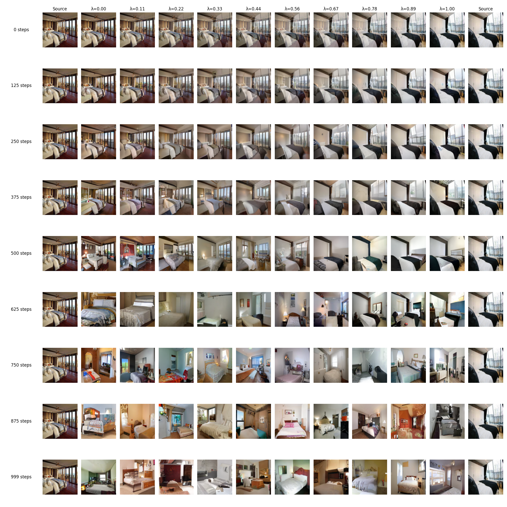

# Image Generation with Diffusion Models

Authors:
- [Mikołaj Gałkowski](https://www.github.com/galkowskim)
- [Hubert Bujakowski](https://www.github.com/hbujakow)

This project was conducted as part of a deep learning course, focusing on generating images using various diffusion model architectures. The objective was to develop and evaluate models capable of producing high-quality images through the reverse diffusion process. The dataset used for training and evaluation consisted of the LSUN Bedroom dataset.

-----------------------

# Training

1. Set up the training environment by installing the required packages defined in the `requirements.txt` file.
2. Navigate to the `src` directory.

Run the training script:
```bash
python train.py --model_type ... --output_dir ... --num_epochs ...
```

-----------------------

# Evaluation

With trained model you can evaluate it using the `model_evaluation.py` script.

```bash
python model_evaluation.py --experiment_dir ... -no_times ... (we used 200)
```


-----------------------

# Model Checkpoints

Model checkpoints are available on the HuggingFace [repositories](https://huggingface.co/galkowskim). The checkpoints for each model type are stored under directories named after the training duration (`model_type_x_epochs_LSUN_bedroom`).

We conducted experiments with three types of diffusion models: DDPM, DDIM, and PNDM. Each model was trained for 5, 10, and 50 epochs to evaluate its performance. The table below summarizes the results using the Fréchet Inception Distance (FID) metric, which measures the quality of generated images.

| Model Type | Epochs | FID    | Animation                                                                  |
|------------|--------|--------|----------------------------------------------------------------------------|
| **DDPM**   | 5      | 34.94  | [animation](https://youtu.be/TsZugI4U3hQ)                                  |
| **DDIM**   | 5      | 128.27 | [animation](https://youtu.be/t72_pV-OjSA)                                  |
| **PNDM**   | 5      | 127.71 | [animation](https://youtu.be/dYGrZyG4U_A)                                  |
| **DDPM**   | 10     | **10.05** | [animation](https://youtu.be/P6XvCMjF0qA)                                  |
| **DDIM**   | 10     | 56.86  | [animation](https://youtu.be/PiR6dClO_vE)                                  |
| **PNDM**   | 10     | 61.44  | [animation](https://youtu.be/KGyXIXjiNck)                                  |
| **DDPM**   | 50     | 12.73  | [animation](https://youtu.be/q1mpepeOkpg)                                  |
| **DDIM**   | 50     | 14.49  | [animation](https://youtu.be/Zef8ofyR49w)                                  |
| **PNDM**   | 50     | 23.44  | [animation](https://youtu.be/weXnxNgGFU8)                                  |

From these results, we observe that the DDPM model, especially when trained for 10 epochs, achieved the lowest FID score, indicating high-quality image generation. Despite the advancements in DDIM and PNDM models, they did not outperform DDPM in our experiments. This may be partly due to the smaller sample size used in our evaluations compared to the original benchmarks.

Animation from the DDPM model trained for 50 epochs:


-------------------

# Latent Space Interpolation

We also investigated the capability of the models to interpolate between latent vectors and generate intermediate images. This exploration demonstrated the models' ability to smoothly transition between different room layouts, lighting conditions, and furniture arrangements. The resulting interpolations highlight the potential of these models for applications such as interior design visualization and scene generation.

Results from the DDPM model trained for 50 epochs:



-------------------
